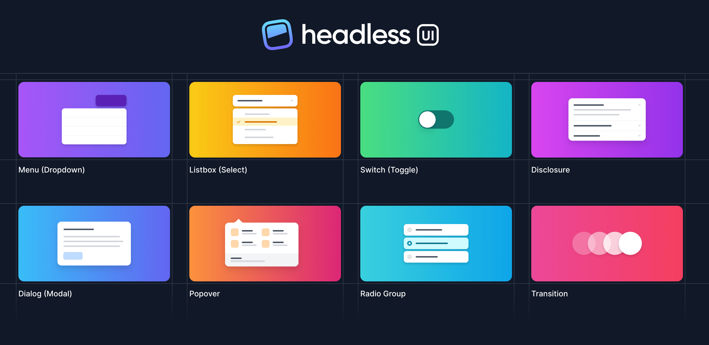

# React Collection Tool

A collection of useful tools and libraries for React development.

## 1. Headless UI

Headless UI provides completely unstyled, accessible UI components that can be easily customized to fit your project's needs.

- **URL:** [https://headlessui.com/](https://headlessui.com/)
- **Detail:** Headless UI offers a wide range of accessible and customizable components such as buttons, menus, dialogs, and more. These components are designed to be used as building blocks for creating your own UI components, offering full control over styling while ensuring accessibility.

## 2. Nivo Chart

Nivo is a rich set of dataviz components, built on top of the D3 and React libraries, and delivering beautiful interactive dataviz components for the web.

- **URL:** [https://nivo.rocks/](https://nivo.rocks/)
- **Detail:** Nivo provides a diverse set of responsive and customizable data visualization components, including bar charts, line charts, pie charts, and more. These components are highly customizable and offer features like animations, legends, and tooltips out of the box.

<!-- You can add an image here if you have one -->

## 3. react DaD

[Insert Tool Description Here]

- **URL:** [https://react-dnd.github.io/react-dnd/about]
- **Detail:** tool for Drag and drap

<!-- You can repeat this pattern for additional tools -->

